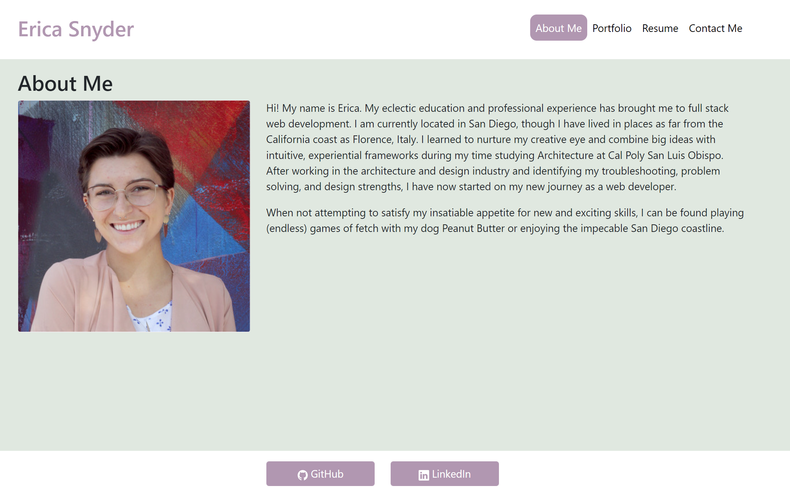

# react-portfolio

## Description

This portfolio is an updated version of the one created with simple HTML and CSS. 

By using React, I was able to create a much more dynamic experience with a simple user interface. 

The deployed version of the application can be found at:
https://ericaleesnyder.github.io/react-portfolio/

## Usage 
 

## License

The license for this application is MIT.

## Questions

If you have any questions about this application, my github profile is https://github.com/ericaleesnyder, and you can email me at ericaleesnyder@gmail.com. 